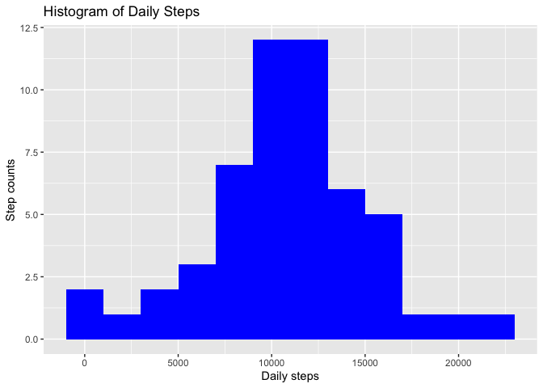
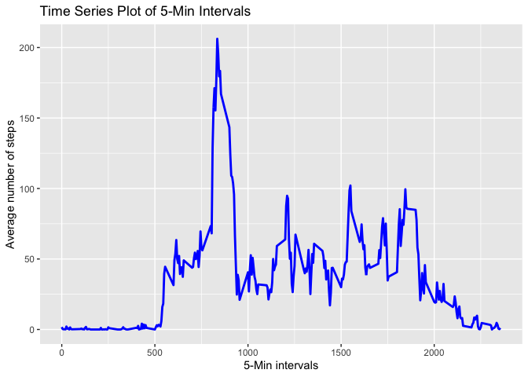
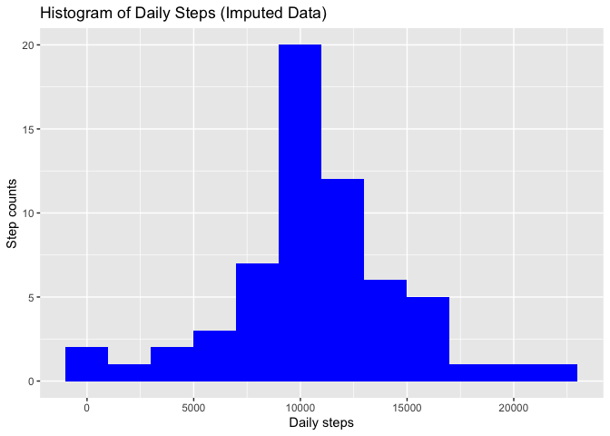
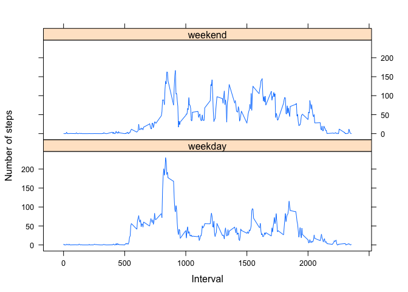

### by George Dai

## Prepare the R environment

In order for the readers to be able to read the code, we will be using *echo = TRUE* throughout this markdown document. Also, we need to use **library()** function to load **knitr**, **ggplot2** packages.


```r
library(ggplot2)
library(knitr)
opts_chunk$set(echo = TRUE, results = 'hold')
```

## Reading and preprocessing the data (Task #1)

We are going to read the dataset, which is the personal activity from a monitoring device by an anonymous person. We use **read.csv()** function to read the data in. We clean the dataset so it becomes tidy.


```r
activity <- read.table('activity.csv', sep=',', header=TRUE, na.strings='NA',
                colClasses=c('integer', 'Date', 'factor'))
```

It is helpful to take a look of the strcuture of the data


```r
str(activity)
```

```
## 'data.frame':	17568 obs. of  3 variables:
##  $ steps   : int  NA NA NA NA NA NA NA NA NA NA ...
##  $ date    : Date, format: "2012-10-01" "2012-10-01" ...
##  $ interval: Factor w/ 288 levels "0","10","100",..: 1 226 2 73 136 195 198 209 212 223 ...
```


## What is mean total number of steps taken per day?

In order for us to calculate the total number of steps per day, we need to aggregate the data as follows. Look at the first and last fee records by using **head()** and **tail()** functions.


```r
stepsperday <- aggregate(steps ~ date, activity, sum)
names(stepsperday) <- c('date', 'steps')
newactivity <- na.omit(activity)
head(stepsperday)
tail(stepsperday)
```

```
##         date steps
## 1 2012-10-02   126
## 2 2012-10-03 11352
## 3 2012-10-04 12116
## 4 2012-10-05 13294
## 5 2012-10-06 15420
## 6 2012-10-07 11015
##          date steps
## 48 2012-11-24 14478
## 49 2012-11-25 11834
## 50 2012-11-26 11162
## 51 2012-11-27 13646
## 52 2012-11-28 10183
## 53 2012-11-29  7047
```

* Plot a histogram to show the number of steps per day (Task #2)


```r
ggplot(stepsperday, aes(x = steps)) + 
        geom_histogram(fill='blue', binwidth=2000) +
        labs(title = "Histogram of Daily Steps", x = "Daily steps", 
               y = "Step counts")
```

<!-- -->

* Calculate the mean and median of the number of steps per day, ignore the missing data. (Task #3)


```r
meansteps <- mean(stepsperday$steps)
mediansteps <- median(stepsperday$steps)
```

It appears that the mean is 10766 and the median is 10765.

## Time series plot of the average number of steps taken (Task #4)


```r
stepsperinterval <- aggregate(newactivity$steps, by=list(interval =
        newactivity$interval), FUN=mean, na.rm=TRUE)
stepsperinterval$interval <- as.integer(levels(stepsperinterval$interval)
        [stepsperinterval$interval])
names(stepsperinterval) <- c('interval', 'steps')
ggplot(stepsperinterval, aes(x=interval, y=steps)) + 
        geom_line(color='blue', size=1) +
        labs(title='Time Series Plot of 5-Min Intervals',
             x='5-Min intervals', y='Average number of steps')
```

<!-- -->

* 5-Min interval that contains the maximum number of steps (Task #5)


```r
maxinterval <- stepsperinterval[which.max(stepsperinterval$steps),]
```

We found out that the $835^{th}$ interval has the maximum of 206 steps.

## Finding and Imputing missing values

* Total number of missing values

The total number of missing values in steps can be calculated using the **is.na()** function.

```r
totalmissing <- sum(is.na(activity$steps))
```

We found out that there are 2304 total missing values.

* Strstegy for filling the missing values in the dataset (Task #6)

Using the average in the same interval as the missing data, we can fill the missing values. 


```r
impdata <- activity
for (i in 1:nrow(impdata)) {
        if (is.na(impdata$steps[i])) {
                impdata$steps[i] <- stepsperinterval[
                        which(impdata$interval[i] ==
                        stepsperinterval$interval),]$steps
        }
}
nn <- sum(!complete.cases(impdata))
```

Make sure all the missing values have been imputed. We find the total number of missing values now is 0.

* Histogram of total number of steps taken each day after missing values are imputed (Task #7)

Now that the missing values have been imputed, we can show the histogram again.


```r
stepsperday <- aggregate(steps ~ date, impdata, sum)
ggplot(stepsperday, aes(x = steps)) + 
        geom_histogram(fill='blue', binwidth=2000) +
        labs(title = "Histogram of Daily Steps (Imputed Data)", 
             x = "Daily steps", y = "Step counts")
```

<!-- -->

* Calculate the mean and median again to see how they compare to the previous values.


```r
meansteps0 <- meansteps
mediansteps0 <- mediansteps
meansteps <- mean(stepsperday$steps)
mediansteps <- median(stepsperday$steps)
```

Now the mean is 10766 and the median is 1.0766189\times 10^{4}. Before the imputing, the mean is 10766 and the median is 10765. 

## Are there differences in activity patterns between weekdays and weekends? (Task #8)

First, let's create factor variables for the day of week.


```r
impdata$dayofweek <- factor(format(impdata$date, '%A'))
levels(impdata$dayofweek)
levels(impdata$dayofweek) <- list(weekday = c('Monday', 'Tuesday',
                'Wednesday', 'Thursday', 'Friday'),
                weekend = c('Saturday', 'Sunday'))
levels(impdata$dayofweek)
table(impdata$dayofweek)
```

```
## [1] "Friday"    "Monday"    "Saturday"  "Sunday"    "Thursday"  "Tuesday"  
## [7] "Wednesday"
## [1] "weekday" "weekend"
## 
## weekday weekend 
##   12960    4608
```

Finally, we plot the time series for both weekdays and weekends.


```r
stepsperday <- aggregate(impdata$steps, list(interval = as.numeric(
        as.character(impdata$interval)), dayofweek = impdata$dayofweek),
        FUN = 'mean')
names(stepsperday)[3] <- 'meansteps'
library(lattice)
xyplot(stepsperday$meansteps ~ stepsperday$interval | stepsperday$dayofweek,
       layout = c(1,2), type = 'l', xlab = 'Interval',
       ylab = 'Number of steps')
```

<!-- -->

